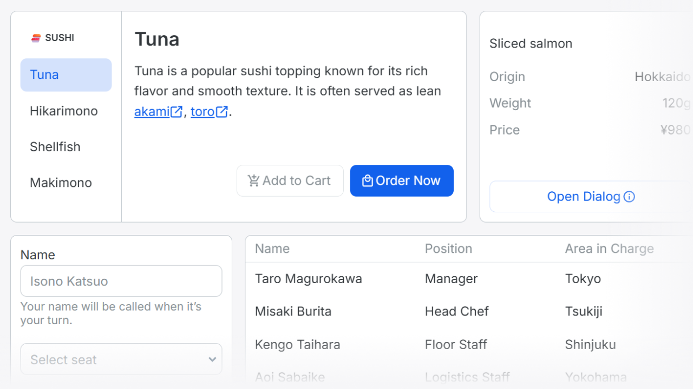

# 

sashimi UI is a minimal CSS framework designed to enhance, not replace, the **native capabilities of HTML**.  
It styles elements such as `<a>`, `<button>`, and `<input>` without unnecessary wrapping or abstraction.  
By embracing the **natural behavior of the web**, sashimi UI lets the platform shine in its purest form.

## Documentation

Visit [https://yuto-hasegawa.github.io/sashimi-ui/](https://yuto-hasegawa.github.io/sashimi-ui/) for full documentation.

## License

Licensed under the [MIT license](LICENSE).